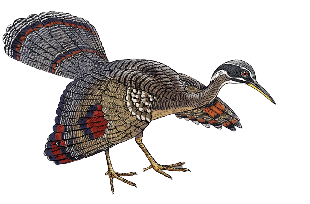

  
  <h1>Machine Learning Design Pattern Notes</h1>
  
  

    Code snippets for textbook Machine Learning Design Patterns published by O'Reily
  

 

<!-- Table of Contents -->

# :notebook_with_decorative_cover: Table of Contents

- [About the Project](#star2-about-the-project)
- [Contact](#handshake-contact)
- [Acknowledgements](#gem-acknowledgements)

<!-- About the Project -->

## :star2: About the Project

Some of my notes taken from the textbook Machine Learning Design Patterns

## :handshake: Contact

Author: Martin Ho

Project Link: [https://github.com/minimartzz/ml-design-patterns](https://github.com/minimartzz/ml-design-patterns)

<!-- Acknowledgments -->

## :gem: Acknowledgements
